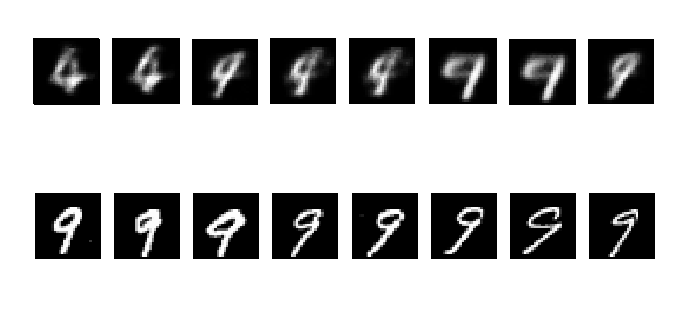
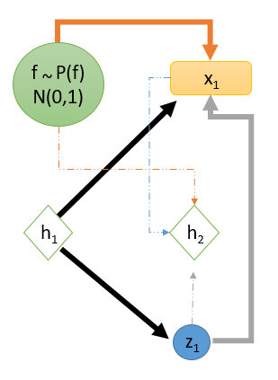
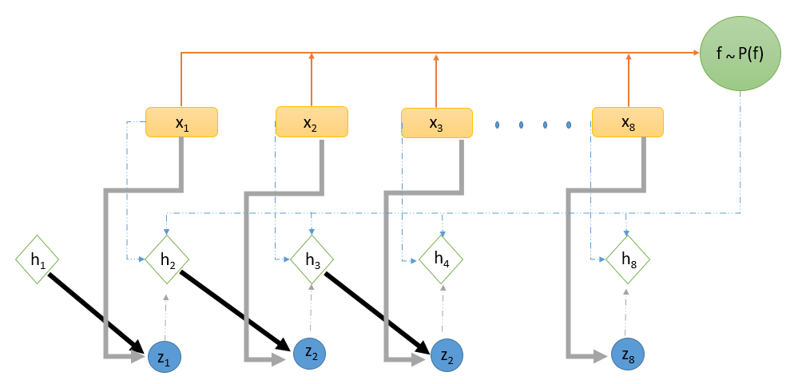

# VariationalRecurrentNeuralNetwork

Variational RNN demo on MNIST (treated as sequence data)

Paper: 

## Run:

To train (Disentangled VRNN): ``` python3 train_dis_vrnn.py ```
(VRNN): ``` python3 train.py```
## Sample Reconstructions:



## Disentangled VRNN (experimental) Model Generation


## Disentangled VRNN Inference



